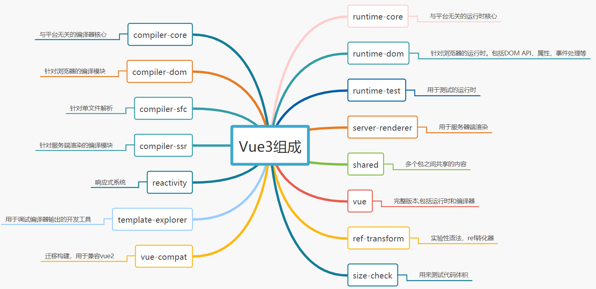

# Vue3源码共读

#### 介绍
共读vue3源码，并手写一个自己的vue3，一起来学习一下吧~

# 版本区别

- 源码采用 `monorepo` 方式进行管理，将模块拆分到package目录中
- `Vue3` 采用`ts`开发,增强类型检测。 `Vue2` 则采用`flow` 
- Vue3的性能优化，支持tree-shaking, 不使用就不会被打包。而vue2是由一个个类堆起来的，并且好多方法都放在原型上，无法tree-shaking
- Vue3后期引入RFC,使得每个版本改动可控rfcs

> 内部代码优化

- `Vue3` 劫持数据采用proxy `Vue2` 劫持数据采用`defineProperty`。 `defineProperty`有性能问题和缺陷
- `Vue3`中对模板编译进行了优化，编译时 生成了Block tree，可以对子节点的动态节点进行收集，可以减少比较，并且采用了 `patchFlag` 标记动态节点
- `Vue3` 采用`compositionApi` 进行组织功能，解决反复横跳，优化复用逻辑 （mixin带来的数据来源不清晰、命名冲突等）, 相比`optionsApi` 类型推断更加方便
- 增加了 `Fragment`,`Teleport`，`Suspense`组件

# 架构分析

## 一、Monorepo介绍

​	`Monorepo` 是管理项目代码的一个方式，指在一个项目仓库(`repo`)中管理多个模块/包(package)

1. 优点
   - **可见性（Visibility）**：每个人都可以看到其他人的代码，这样可以带来更好的协作和跨团队贡献——不同团队的开发人员都可以修复代码中的bug，而你甚至都不知道这个bug的存在。
   - **更简单的依赖关系管理（Simpler dependency management）**：共享依赖关系很简单，因为所有模块都托管在同一个存储库中，因此都不需要包管理器。
   - **唯一依赖源（Single source of truth）**：每个依赖只有一个版本，意味着没有版本冲突，没有依赖地狱。
   - **一致性（Consistency）**：当你把所有代码库放在一个地方时，执行代码质量标准和统一的风格会更容易。
   - **共享时间线（Shared timeline）**：API或共享库的变更会立即被暴露出来，迫使不同团队提前沟通合作，每个人都得努力跟上变化。
   - **原子提交（Atomic commits）**：原子提交使大规模重构更容易，开发人员可以在一次提交中更新多个包或项目。
   - **隐式CI（Implicit CI）**：因为所有代码已经统一维护在一个地方，因此可以保证持续集成[3]。
   - **统一的CI/CD（Unified CI/CD）**：可以为代码库中的每个项目使用相同的CI/CD[4]部署流程。
   - **统一的构建流程（Unified build process）**：代码库中的每个应用程序可以共享一致的构建流程[5]。
2. 缺点	
   - **仓库体积大 **：由于多个包都统一放在一个仓库里面，必然会导致仓库体积庞大。
   - **性能差（Bad performance）**：单一代码库难以扩大规模，像git blame这样的命令可能会不合理的花费很长时间执行，IDE也开始变得缓慢，生产力受到影响，对每个提交测试整个repo变得不可行。
   - **破坏主线（Broken main/master）**：主线损坏会影响到在单一代码库中工作的每个人，这既可以被看作是灾难，也可以看作是保证测试既可以保持简洁又可以跟上开发的好机会。
   - **学习曲线（Learning curve）**：如果代码库包含了许多紧密耦合的项目，那么新成员的学习曲线会更陡峭。
   - **大量的数据（Large volumes of data）**：单一代码库每天都要处理大量的数据和提交。
   - **所有权（Ownership）**：维护文件的所有权更有挑战性，因为像Git或Mercurial这样的系统没有内置的目录权限。
   - **Code reviews**：通知可能会变得非常嘈杂。例如，GitHub有有限的通知设置，不适合大量的pull request和code review。

## 二、Vue3项目结构

- **`reactivity`**:响应式系统

- **`runtime-core`**:与平台无关的运行时核心 (可以创建针对特定平台的运行时 - 自定义渲染器)

- **`runtime-dom`**: 针对浏览器的运行时。包括`DOM API`，属性，事件处理等

- **`runtime-test`**:用于测试

- **`server-renderer`**:用于服务器端渲染

- **`compiler-core`**:与平台无关的编译器核心

- **`compiler-dom`**: 针对浏览器的编译模块

- **`compiler-ssr`**: 针对服务端渲染的编译模块

- **`compiler-sfc`**: 针对单文件解析

- **`size-check`**:用来测试代码体积

- **`template-explorer`**：用于调试编译器输出的开发工具

- **`shared`**：多个包之间共享的内容

- **`vue`**:完整版本,包括运行时和编译器

  

  ------
  
  ```
                              +---------------------+
                              |                     |
                              |  @vue/compiler-sfc  |
                              |                     |
                              +-----+--------+------+
                                    |        |
                                    v        v
                 +---------------------+    +----------------------+
                 |                     |    |                      |
       +-------->|  @vue/compiler-dom  +--->|  @vue/compiler-core  |
       |         |                     |    |                      |
  +----+----+    +---------------------+    +----------------------+
  |         |
  |   vue   |
  |         |
  +----+----+   +---------------------+    +----------------------+    +-------------------+
      |         |                     |    |                      |    |                   |
      +-------->|  @vue/runtime-dom   +--->|  @vue/runtime-core   +--->|  @vue/reactivity  |
                |                     |    |                      |    |                   |
                +---------------------+    +----------------------+    +-------------------+
  ```

## 三、设计思想

### 1.声明式框架

> Vue3 依旧是声明式的框架，用起来简单。

**命令式**和**声明式**区别

- 早在 JQ 的时代编写的代码都是命令式的，命令式框架重要特点就是关注过程
- 声明式框架更加关注结果。命令式的代码封装到了 Vuejs 中，过程靠 vuejs 来实现

> 声明式代码更加简单，不需要关注实现，按照要求填代码就可以 （给上原材料就出结果）

```ts
- 命令式编程：
let numbers = [1,2,3,4,5]
let total = 0
for(let i = 0; i < numbers.length; i++) {
  total += numbers[i] - 关注了过程
}
console.log(total)

- 声明式编程：
let total2 = numbers.reduce(function (memo,current) {
  return memo + current
},0)
console.log(total2)
```

### 2.采用虚拟ODM

新旧虚拟节点，找到变化在进行更新。虚拟 DOM 就是一个对象，用来描述真实 DOM 的。

```ts
const vnode = {
  __v_isVNode: true,
  __v_skip: true,
  type,
  props,
  key: props && normalizeKey(props),
  ref: props && normalizeRef(props),
  children,
  component: null,
  el: null,
  patchFlag,
  dynamicProps,
  dynamicChildren: null,
  appContext: null,
};
```

## 3.区分编译时和运行时

- 我们需要有一个虚拟 DOM，调用渲染方法将虚拟 DOM 渲染成真实 DOM （缺点就是虚拟 DOM 编写麻烦）
- 专门写个编译时可以将模板编译成虚拟 DOM （在构建的时候进行编译性能更高，不需要再运行的时候进行编译，而且 vue3 在编译中做了很多优化）

## 4.vue3 新增设计

- Vue3.0 更注重模块上的拆分，在 2.0 中无法单独使用部分模块。需要引入完整的 Vuejs(例如只想使用使用响应式部分，但是需要引入完整的 Vuejs)， Vue3 中的模块之间耦合度低，模块可以独立使用。 **拆分模块**
- Vue2 中很多方法挂载到了实例中导致没有使用也会被打包（还有很多组件也是一样）。通过构建工具 Tree-shaking 机制实现按需引入，减少用户打包后体积。同时也移除了一些不需要的功能（filter、inline-template） **重写 API**
- Vue3 允许自定义渲染器，扩展能力强。不会发生以前的事情，改写 Vue 源码改造渲染方式。 **扩展更方便**
- 使用 RFC 来确保改动和设计都是经过 Vuejs 核心团队探讨并得到确认的。也让用户可以了解每一个功能采用或废弃的前因后果。 **采用[RFC](https://github.com/vuejs/rfcs/tree/master/active-rfcs)**

# 响应式模块

## 1.reactive

先说结论：<font color="#08e">vue3的响应式原理主要还是<font color="#f00">通过proxy配合Reflect反射形成的，其中Reflect主要是将内部的this指向指为当前的proxy代理对象。</font></font>

需要关注的点如下↓

- 判断传递进来的`target`是否为一个对象，如果不是，直接返回。
- 同一个对象重复代理，需要做缓存（使用Weakmap对象处理）。
- 禁止proxy代理对象嵌套proxy代理对象，需要做判断。如果是代理对象，直接返回。

针对于如上几点，我们编码如下

```ts
import { isObject } from "@vue/shared";
import { mutableHandlers } from "./baseHandlers";
export const enum ReactiveFlags {
  IS_REACTIVE = "__v_isReactive",
}
const reactiveMap = new WeakMap(); // key 只能是对象
export function reactive(target) {
  /*
    代理对象作为参数再次被代理时，两者应该是 ‘===’的关系，对应情形↓
    const p1 = reactive(obj)
    const p2 = reactive(p1)
    结果应该是 p1 === p2
  */
  if (!isObject(target)) {
    return target;
  }
  /*
    禁止嵌套，已经是proxy代理对象，就不用再次代理了,对应情形↓
    const p1 = reactive(obj);
    cosnt p2 = reactive(obj)
  */
  if (target[ReactiveFlags.IS_REACTIVE]) {
    return target;
  }
  const exisitsProxy = reactiveMap.get(target);
  if (exisitsProxy) {
    return exisitsProxy;
  }
  // 代理 ，我通过代理对象操作属性，你会去源对象上进行获取
  const proxy = new Proxy(target, mutableHandlers);
  // 缓存一下 代理过的对象，下次再进行代理的时候直接拿出来用即可
  // target -> proxy
  reactiveMap.set(target, proxy);
  return proxy;
}
```

## 2.effect 副作用函数

## 3.computed计算属性

> 计算属性的目的是根据状态衍生属性，我们希望这个属性有缓存功能。如果<font color="#f00">依赖的数据不变就不会重新计算。</font>

实现步骤

1. 判断传入的形参`getterOrOptions`的类型是否是一个函数还是对象，函数代表仅有getter，对象代表既有getter也有setter。
2. computed接受一个函数或者一个对象作为参数，返回值是<font color="#f00">`ComputeedRefImpl`</font>实例。并通过`.value`的方式获取值。
3. 运行computed的时候，需要把effect方法中的<font color="#f00">`ReactiveEffect`</font>这个核心类给拎出来，而不是直接调用effect方法，原因是无法控制什么时候执行effect传递的函数。
4. 取值的时候，返回当前`this.effect.run()`的返回值，即computed传递的函数的返回值。

具体源码实现

```tsx
import { isFunction } from "@vue/shared";
import {
  activeEffect,
  ReactiveEffect,
  track,
  trackEffects,
  triggerEffects,
} from "./effect";

const noop = () => {};

class ComputedRefImpl {
  public dep = undefined;
  public effect = undefined;
  public __v_isRef = true; // 意味着有这个属性 需要用.value来取值
  public _dirty = true; // true:重新执行 false: 走缓存
  public _value; // 默认的缓存结果
  constructor(getter, public setter) {
    // 这里源码中不能使用 effect(()=>{},{scheduler:()=>{}})
    this.effect = new ReactiveEffect(getter, () => {
      this._dirty = true;
      triggerEffects(this.dep);
    });
  }
  get value() {
    if (this._dirty) {
      // 取值才执行，并且把取到的值缓存起来
      this._value = this.effect.run();
      this._dirty = false; // 意味着取过了
    }
    return this._value;
  }
  set value(newValue) {
    this.setter(newValue);
  }
}


export function computed(getterOrOptions) {
  let onlyGetter = isFunction(getterOrOptions);
  let getter;
  let setter;

  if (onlyGetter) {
    getter = getterOrOptions;
    setter = noop;
  } else {
    getter = getterOrOptions.get;
    setter = getterOrOptions.set || noop; // 如果没有set,默认绑定一个空函数
  }
  // getter=方法必须存在
  return new ComputedRefImpl(getter, setter);
}
```

在上述源码中，还有一个问题：就是computed属性是否也能触发effect的更新呢？答案是<font color="#f00">不能</font>的。原因在于effect只收集到了reactive的值的响应，而computed计算属性需要重新编写脚才能实现。(简单的来说就是一个收集computed的属性对应的effect依赖，在特定的时间触发依赖的过程。这和reactive收集effect的依赖没有很大的差别。)

对于vue3源版本中是可以的。因此我们编码如下↓

```ts
export function trackEffects(dep) {
  let shouldTrack = !dep.has(activeEffect);
  if (shouldTrack) {
    dep.add(activeEffect);
    activeEffect.deps.push(dep); // 后续需要通过effect来清理的时候可以去使用
    // 一个属性对应多个effect， 一个effect对应着多个属性
    // 属性 和 effect的关系是多对多的关系
  }
}

class ComputedRefImpl {
  public dep = undefined; // 专门收集计算属性的effect的
  
  ...
  // 类的属性访问器 Object.defineProperty(实例,value,{get})
  get value() {
      // 如果有activeEffect 意味着这个计算属性在effct中使用
      // 需要让计算属性收集这个effect
      // 用户取值发生依赖收集
    if (activeEffect) {
      trackEffects(this.dep || (this.dep = new Set()));
    }
    if (this._dirty) {
      // 取值才执行，并且把取到的值缓存起来
      this._value = this.effect.run();
      this._dirty = false; // 意味着取过了
    }
    return this._value;
  }
}
```

## 4.watch监听属性

watch 的核心就是观测一个响应式数据，当数据变化时通知并执行回调 （那也就是说它本身就是一个 effect）

### 4.1监测响应式对象

```tsx
watch(state, (oldValue, newValue) => {
  // 监测一个响应式值的变化
  console.log(oldValue, newValue);
});
```

```tsx
function traverse(value, seen = new Set()) {
  if (!isObject(value)) {
    return value;
  }
  if (seen.has(value)) {
    return value;
  }
  seen.add(value);
  for (const k in value) {
    // 递归访问属性用于依赖收集
    traverse(value[k], seen);
  }
  return value;
}
export function isReactive(value) {
  return !!(value && value[ReactiveFlags.IS_REACTIVE]);
}
export function watch(source, cb) {
  let getter;
  if (isReactive(source)) {
    // 如果是响应式对象
    getter = () => traverse(source); // 包装成effect对应的fn, 函数内部进行遍历达到依赖收集的目的
  }
  let oldValue;
  const job = () => {
    const newValue = effect.run(); // 值变化时再次运行effect函数,获取新值
    cb(newValue, oldValue);
    oldValue = newValue;
  };
  const effect = new ReactiveEffect(getter, job); // 创建effect
  oldValue = effect.run(); // 运行保存老值
}
```

### 4.2 监听函数

```tsx
export function watch(source, cb) {
  let getter;
  if (isReactive(source)) {
    // 如果是响应式对象
    getter = () => traverse(source);
  } else if (isFunction(source)) {
    getter = source; // 如果是函数则让函数作为fn即可
  }
  // ...
}
```

### 4.3immediate实现

```tsx
export function watch(source,cb,{immediate} = {} as any){
	const effect = new ReactiveEffect(getter,job) // 创建effect
    if(immediate){ // 需要立即执行，则立刻执行任务
        job();
    }
    oldValue = effect.run();
}
```

### 4.4 watch 中 cleanup 实现

```tsx
const state = reactive({ flag: true, name: 'jw', age: 30 });
let timer = 3000
function getData(newVal) {
  return new Promise((resolve, reject) => {
    setTimeout(() => {
      resolve(newVal);
    }, timer -= 1000);
  });
}
watch(state, async (newValue, oldValue, onCleanup) => {
  let clear = false;
  onCleanup(() => {
    clear = true;
  });
  let r = await getData(newValue.name);
  if (!clear) {
    document.body.innerHTML = r;
  }
  // 监测一个响应式值的变化
}, { immediate: true });
state.age = 31;
state.age = 32;
```

```tsx
let cleanup;
let onCleanup = (fn) => {
  cleanup = fn;
};
const job = () => {
  const newValue = effect.run();
  if (cleanup) cleanup(); // 下次watch执行前调用上次注册的回调
  cb(newValue, oldValue, onCleanup); // 传入onCleanup函数
  oldValue = newValue;
};
```

### 4.5 watchEffect的实现

> 我们可以使用响应性属性编写一个方法，**每当它们的任何值更新时**，我们的方法就会重新运行。**`watchEffect`在初始化时也会立即运行**

```tsx
const state = reactive({ flag: true, name: 'jw', age: 30 });
watchEffect(() => app.innerHTML = state.name);
setTimeout(() => {
  state.name = 'Mr Jiang'
}, 1000)
```

```tsx
export function watch(source, cb, options) {
  return doWatch(source, cb, options);
}
export function watchEffect(effect, options) {
  return doWatch(effect, null, options);
}
```

```tsx
const job = () => {
  if (cb) {
    const newValue = effect.run(); // 值变化时再次运行effect函数,获取新值
    if (cleanup) cleanup(); // 下次watch执行前调用上次注册的回调
    cb(newValue, oldValue, onCleanup);
    oldValue = newValue;
  } else {
    effect.run(); // 重新执行effect即可
  }
};
```

